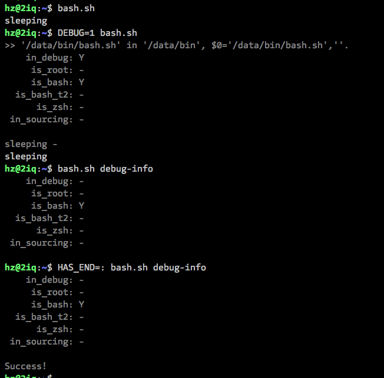

# bash.sh


`bash.sh` is a template for shell developing.


## Usages

### Command Line Options

```bash
$ ./bash.sh cool
$ DEBUG=1 ./bash.sh

$ ./bash.sh debug-info

$ ./bash.sh 'is_root && echo Y'
$ sudo ./bash.sh 'is_root && echo Y'
$ sudo DEBUG=1 ./bash.sh 'is_root && echo y'

$ HAS_END=: ./bash.sh
$ HAS_END=false ./bash.sh
```


### Use It

Copy [bash.sh](bash.sh) and rename as your main entry, and go ahead.

> Modify `_my_main.do.sth()` as you want.


## Samples




## Knives Document

### `in_debug`

in debug mode?

toggle environment variable `DEBUG` to switch between `normal_mode` and `debug_mode`.

```bash
is_debug && echo 'debug mode' || echo 'normal mode'
```


### `debug` $*

print string for debug. In normal mode, the string message will be stripped.

```bash
debug I am buggy but you don't know
debug 'I am buggy but you don't know'
```


### `headline` $*

print a hilight message string.

```bash
headline here is the hilighted title
```


### `is_bash` & `is_zsh`

check if running under bash/zsh interpretor or not

```bash
is_bash && echo 'in bash'
is_zsh && echo 'in zsh'
```


### `is_linux`, `is_darwin`

check if running in Linux/macOS shell.

```bash
is_linux && echo 'in linux'
is_darwin && grep -E 'LISTEN|UDP' somefile || grep -P 'LISTEN|UDP' somefile
```


### `realpathx`

cross impl for linux `realpath`.


### Environment Variables

#### `DEBUG` = {1|0}


#### `HAS_END` = {true|:|false}


#### `CD`: directory of `bash.sh`


#### `SCRIPT`: full path of `bash.sh`


## License

MIT.

Enjoy It!
